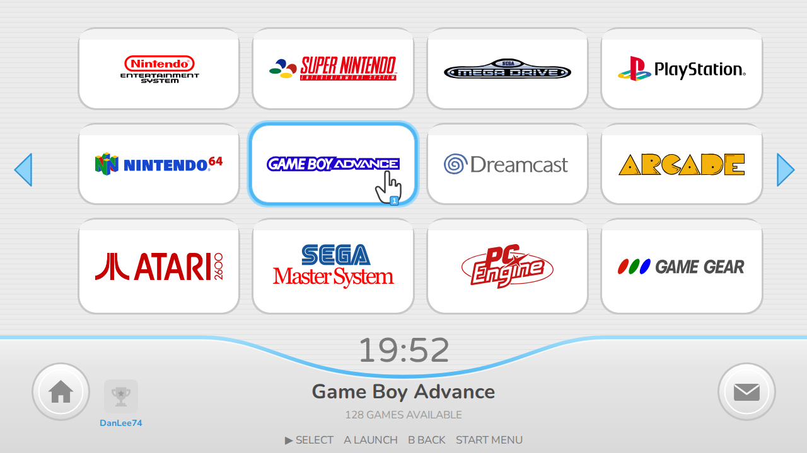
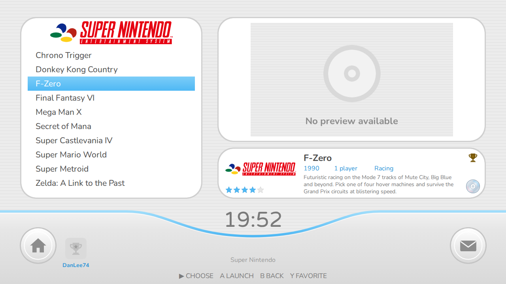

# BatWiiCera

A retro console "channel menu" theme for Batocera's EmulationStation.

**Author:** Dan Lee (personal project)
**Current version:** 0.1.6
**Licence:** Creative Commons BY-NC-SA 4.0

## Screenshots

Layout mock-ups rendered from the theme's own assets, fonts and coordinates at
1280 x 720. They show the intended layout; captures from a real Batocera device
will be added after on-device testing.

**Console channel grid (system view)** - pointer hand on the highlighted tile, RetroAchievements avatar and user name left of the clock



**Game list with live preview (detailed view, default)** - gold trophy marks a game with achievements, compact disc marks save states



Each release of the theme is kept in its own folder named after the version, so
every version stays available and installable. Pick the folder you want and copy
the `BatWiiCera` theme folder inside it to `/userdata/themes/` on your device,
or download that version's zip and extract it there. The zip contains the
`BatWiiCera` folder at its root, so extracting it into `/userdata/themes/`
puts everything in the right place.

**Latest download:** [`BatWiiCera-v0.1.6.zip`](v0.1.6/BatWiiCera-v0.1.6.zip)

## Versions

| Version | Folder | Zip | Date | Status | Summary |
| --- | --- | --- | --- | --- | --- |
| 0.1.6 | [`v0.1.6/BatWiiCera`](v0.1.6/BatWiiCera) | [`BatWiiCera-v0.1.6.zip`](v0.1.6/BatWiiCera-v0.1.6.zip) | 2026-10-04 | Release candidate, awaiting on-device sign-off | Readable menu buttons, Menu/Start pills removed, save-state disc indicator |
| 0.1.5 | [`v0.1.5/BatWiiCera`](v0.1.5/BatWiiCera) | [`BatWiiCera-v0.1.5.zip`](v0.1.5/BatWiiCera-v0.1.5.zip) | 2026-10-04 | Superseded by 0.1.6 | On-device fixes: coloured logos, no tile labels, no clipped selection, blue menu button |
| 0.1.4 | [`v0.1.4/BatWiiCera`](v0.1.4/BatWiiCera) | [`BatWiiCera-v0.1.4.zip`](v0.1.4/BatWiiCera-v0.1.4.zip) | 2026-10-04 | Superseded by 0.1.5 | House and envelope buttons get click actions (search, Netplay, back, game options) |
| 0.1.3 | [`v0.1.3/BatWiiCera`](v0.1.3/BatWiiCera) | [`BatWiiCera-v0.1.3.zip`](v0.1.3/BatWiiCera-v0.1.3.zip) | 2026-10-04 | Superseded by 0.1.4 | RetroAchievements integration replaces the SD card icon; trophy markers in game views |
| 0.1.2 | [`v0.1.2/BatWiiCera`](v0.1.2/BatWiiCera) | [`BatWiiCera-v0.1.2.zip`](v0.1.2/BatWiiCera-v0.1.2.zip) | 2026-10-04 | Superseded by 0.1.3 | Pointer hand now follows the highlighted tile in the console and game grids |
| 0.1.1 | [`v0.1.1/BatWiiCera`](v0.1.1/BatWiiCera) | [`BatWiiCera-v0.1.1.zip`](v0.1.1/BatWiiCera-v0.1.1.zip) | 2026-10-04 | Superseded by 0.1.2 | Adds a bundled quiet background music loop, music option on by default |
| 0.1.0 | [`v0.1.0/BatWiiCera`](v0.1.0/BatWiiCera) | none | 2026-10-04 | Superseded by 0.1.1 | Initial release: console channel grid, game list with video preview, game grid, menus, two colour sets, 16:9 and 4:3 layouts |

Full details for each version are in that version's own `README.md`.
Every change is also logged in [`CHANGE_CONTROL.md`](CHANGE_CONTROL.md).

## Repository layout

```
README.md               this file (version index)
CHANGE_CONTROL.md       change register, one entry per change, never deleted
v0.1.0/BatWiiCera/      version 0.1.0 of the theme (installable folder)
v0.1.0/previews/        layout mock-ups for version 0.1.0
v0.1.1/BatWiiCera/      version 0.1.1 of the theme (installable folder)
v0.1.1/BatWiiCera-v0.1.1.zip  the same folder packaged for download
v0.1.1/previews/        layout mock-ups (unchanged from 0.1.0)
v0.1.2/BatWiiCera/      version 0.1.2 of the theme (installable folder)
v0.1.2/BatWiiCera-v0.1.2.zip  the same folder packaged for download
v0.1.2/previews/        layout mock-ups for version 0.1.2
v0.1.3/BatWiiCera/      version 0.1.3 of the theme (installable folder)
v0.1.3/BatWiiCera-v0.1.3.zip  the same folder packaged for download
v0.1.3/previews/        layout mock-ups for version 0.1.3
v0.1.4/BatWiiCera/      version 0.1.4 of the theme (installable folder)
v0.1.4/BatWiiCera-v0.1.4.zip  the same folder packaged for download
v0.1.4/previews/        layout mock-ups (unchanged from 0.1.3)
v0.1.5/BatWiiCera/      version 0.1.5 of the theme (installable folder)
v0.1.5/BatWiiCera-v0.1.5.zip  the same folder packaged for download
v0.1.5/previews/        layout mock-ups for version 0.1.5
v0.1.6/BatWiiCera/      version 0.1.6 of the theme (installable folder)
v0.1.6/BatWiiCera-v0.1.6.zip  the same folder packaged for download
v0.1.6/previews/        layout mock-ups for version 0.1.6
*.jpg                   reference screenshots of the original console menu
```

## Change control

This repository follows a simple change-management process modelled on
ISO 27001:2022 Annex A control 8.32:

1. Every change is raised as a numbered change record in `CHANGE_CONTROL.md`
   with author, company, description, risk, test evidence and rollback plan.
2. Each new theme version is created in a new `vX.Y.Z/` folder; earlier
   folders are never modified or removed.
3. Work happens on a `release/vX.Y.Z` branch and is merged to `main` once the
   change record is approved.
4. The version's `README.md` lists every change made in that version.

## Credits

Built with reference to, and reusing assets under CC-BY-NC-SA from,
Carbon (Rookervik, Nils Bonenberger, Fabrice Caruso), Art Book Next
(Anthony Caccese), es-theme-minimal (lilbud, Fabrice Caruso) and
PlayStation-X (pajarorrojo). Fonts: Varela Round (Apache 2.0) and
Nunito (SIL OFL 1.1). See `v0.1.6/BatWiiCera/LICENSE` for the full notices.

This is a fan-made tribute and is not affiliated with or endorsed by any
console manufacturer. No original console artwork, fonts or audio are included; the bundled music loop was supplied by the author.
