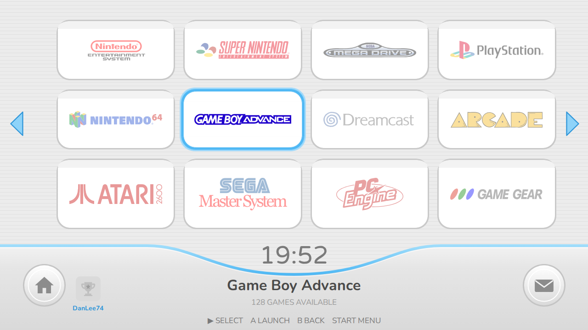
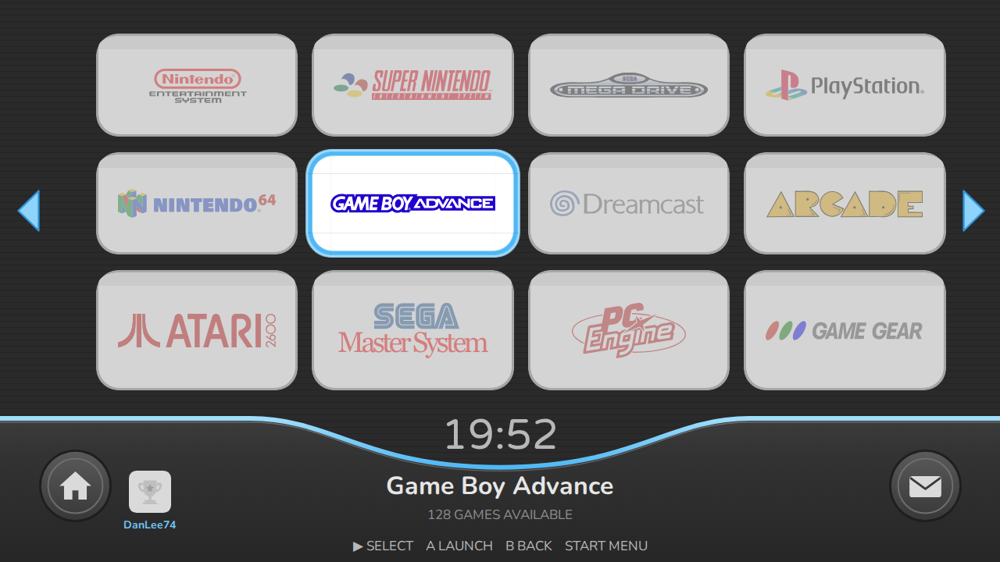
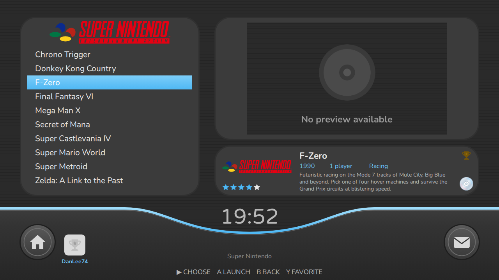

# BatWiiCera

A retro console "channel menu" theme for Batocera's EmulationStation.

**Author:** yiddifliddo (personal project)
**Current version:** 0.1.21
**Licence:** Creative Commons BY-NC-SA 4.0

## Screenshots

Layout mock-ups rendered from the theme's own assets, fonts and coordinates at
1280 x 720. They show the intended layout; captures from a real Batocera device
will be added after on-device testing.

**Console channel grid (system view)** - logos washed-out until highlighted, RetroAchievements avatar and user name left of the clock



**Game list with live preview (detailed view, default)** - gold trophy marks a game with achievements, compact disc marks save states


**Dark grey colour set**





Each release of the theme is kept in its own folder named after the version, so
every version stays available and installable. Pick the folder you want and copy
the `BatWiiCera` theme folder inside it to `/userdata/themes/` on your device,
or download that version's zip and extract it there. The zip contains the
`BatWiiCera` folder at its root, so extracting it into `/userdata/themes/`
puts everything in the right place.

**Latest download:** [`BatWiiCera-v0.1.14.zip`](v0.1.14/BatWiiCera-v0.1.14.zip) (theme and embedded Plaza)

## Plaza channel

The [`plaza/`](plaza) folder holds the **BatWiiCera Plaza**, a companion
channel: one shared online football stadium where players meet as original
cartoon avatars, see what everyone is playing, run around, hop, slap, kick a
ball and score goals.
It has its own README, licence (MIT) and change register.

The public Plaza server runs on Railway from this repository's `main` branch
and is built into the client, so players type nothing. Batocera has no LÖVE
engine, so the Plaza bundles its own runtime (x86_64 for now). Installing the channel
on a Batocera box is one of: extract the full-install zip onto the share and
reboot; drop `Plaza.sh` into `roms/ports` and start it once; or use the
client's own install item. Details in the theme README and
[`plaza/README.md`](plaza/README.md).

## Versions

| Version | Folder | Zip | Date | Status | Summary |
| --- | --- | --- | --- | --- | --- |
| 0.1.21 | [`v0.1.21/BatWiiCera`](v0.1.21/BatWiiCera) | [`BatWiiCera-v0.1.21.zip`](v0.1.21/BatWiiCera-v0.1.21.zip), [`BatWiiCera-full-v0.1.21.zip`](v0.1.21/BatWiiCera-full-v0.1.21.zip) | 2026-10-05 | Release candidate, awaiting on-device sign-off | Plaza 0.1.9: pitch markings to scale; netplay relay in the server package |
| 0.1.20 | [`v0.1.20/BatWiiCera`](v0.1.20/BatWiiCera) | [`BatWiiCera-v0.1.20.zip`](v0.1.20/BatWiiCera-v0.1.20.zip), [`BatWiiCera-full-v0.1.20.zip`](v0.1.20/BatWiiCera-full-v0.1.20.zip) | 2026-10-05 | Superseded by 0.1.21; published to the distribution repository | RetroAchievements avatar: cache-busting address tag |
| 0.1.19 | [`v0.1.19/BatWiiCera`](v0.1.19/BatWiiCera) | [`BatWiiCera-v0.1.19.zip`](v0.1.19/BatWiiCera-v0.1.19.zip), [`BatWiiCera-full-v0.1.19.zip`](v0.1.19/BatWiiCera-full-v0.1.19.zip) | 2026-10-05 | Superseded by 0.1.20 | Plaza 0.1.7: football stadium, new avatars and movement, generated names |
| 0.1.18 | [`v0.1.18/BatWiiCera`](v0.1.18/BatWiiCera) | [`BatWiiCera-v0.1.18.zip`](v0.1.18/BatWiiCera-v0.1.18.zip), [`BatWiiCera-full-v0.1.18.zip`](v0.1.18/BatWiiCera-full-v0.1.18.zip) | 2026-10-05 | Superseded by 0.1.19 | Menu buttons pill-shaped again; RetroAchievements avatar shows the real picture |
| 0.1.17 | [`v0.1.17/BatWiiCera`](v0.1.17/BatWiiCera) | [`BatWiiCera-v0.1.17.zip`](v0.1.17/BatWiiCera-v0.1.17.zip), [`BatWiiCera-full-v0.1.17.zip`](v0.1.17/BatWiiCera-full-v0.1.17.zip) | 2026-10-05 | Superseded by 0.1.18 | Plaza channel starts: bundled LÖVE runtime (Plaza 0.1.6), one launcher, game-screen artwork |
| 0.1.16 | [`v0.1.16/BatWiiCera`](v0.1.16/BatWiiCera) | [`BatWiiCera-v0.1.16.zip`](v0.1.16/BatWiiCera-v0.1.16.zip), [`BatWiiCera-full-v0.1.16.zip`](v0.1.16/BatWiiCera-full-v0.1.16.zip) | 2026-10-05 | Superseded by 0.1.17 (Plaza channel could not start) | Second music track (menu theme) and a four-way Background music choice |
| 0.1.15 | [`v0.1.15/BatWiiCera`](v0.1.15/BatWiiCera) | [`BatWiiCera-v0.1.15.zip`](v0.1.15/BatWiiCera-v0.1.15.zip), [`BatWiiCera-full-v0.1.15.zip`](v0.1.15/BatWiiCera-full-v0.1.15.zip) | 2026-10-05 | Superseded by 0.1.16; published to the distribution repository | Plaza install automated (built-in server, Ports entry, auto restart, full-install zip); author credit yiddifliddo |
| 0.1.14 | [`v0.1.14/BatWiiCera`](v0.1.14/BatWiiCera) | [`BatWiiCera-v0.1.14.zip`](v0.1.14/BatWiiCera-v0.1.14.zip) | 2026-10-05 | Superseded by 0.1.15 | Embedded Plaza updated to 0.1.3 (terminal-free install) |
| 0.1.13 | [`v0.1.13/BatWiiCera`](v0.1.13/BatWiiCera) | [`BatWiiCera-v0.1.13.zip`](v0.1.13/BatWiiCera-v0.1.13.zip) | 2026-10-05 | Superseded by 0.1.14 | Embedded Plaza updated to 0.1.2 (Railway support and guide) |
| 0.1.12 | [`v0.1.12/BatWiiCera`](v0.1.12/BatWiiCera) | [`BatWiiCera-v0.1.12.zip`](v0.1.12/BatWiiCera-v0.1.12.zip) | 2026-10-05 | Superseded by 0.1.13 | Plaza 0.1.1 embedded in the theme (`_plaza/`) with installer and VPS guide |
| 0.1.11 | [`v0.1.11/BatWiiCera`](v0.1.11/BatWiiCera) | [`BatWiiCera-v0.1.11.zip`](v0.1.11/BatWiiCera-v0.1.11.zip) | 2026-10-05 | Superseded by 0.1.12 | Bundles the Plaza channel logo |
| 0.1.10 | [`v0.1.10/BatWiiCera`](v0.1.10/BatWiiCera) | [`BatWiiCera-v0.1.10.zip`](v0.1.10/BatWiiCera-v0.1.10.zip) | 2026-10-04 | Superseded by 0.1.11 | Logos no longer stuck grey (washed-out until highlighted); readable dark menus |
| 0.1.9 | [`v0.1.9/BatWiiCera`](v0.1.9/BatWiiCera) | [`BatWiiCera-v0.1.9.zip`](v0.1.9/BatWiiCera-v0.1.9.zip) | 2026-10-04 | Superseded by 0.1.10 | Pointer hand removed completely |
| 0.1.8 | [`v0.1.8/BatWiiCera`](v0.1.8/BatWiiCera) | [`BatWiiCera-v0.1.8.zip`](v0.1.8/BatWiiCera-v0.1.8.zip) | 2026-10-04 | Superseded by 0.1.9 | Dark grey colour set (dark mode) |
| 0.1.7 | [`v0.1.7/BatWiiCera`](v0.1.7/BatWiiCera) | [`BatWiiCera-v0.1.7.zip`](v0.1.7/BatWiiCera-v0.1.7.zip) | 2026-10-04 | Superseded by 0.1.8 | Console logos grey until highlighted, then full colour |
| 0.1.6 | [`v0.1.6/BatWiiCera`](v0.1.6/BatWiiCera) | [`BatWiiCera-v0.1.6.zip`](v0.1.6/BatWiiCera-v0.1.6.zip) | 2026-10-04 | Superseded by 0.1.7 | Readable menu buttons, Menu/Start pills removed, save-state disc indicator |
| 0.1.5 | [`v0.1.5/BatWiiCera`](v0.1.5/BatWiiCera) | [`BatWiiCera-v0.1.5.zip`](v0.1.5/BatWiiCera-v0.1.5.zip) | 2026-10-04 | Superseded by 0.1.6 | On-device fixes: coloured logos, no tile labels, no clipped selection, blue menu button |
| 0.1.4 | [`v0.1.4/BatWiiCera`](v0.1.4/BatWiiCera) | [`BatWiiCera-v0.1.4.zip`](v0.1.4/BatWiiCera-v0.1.4.zip) | 2026-10-04 | Superseded by 0.1.5 | House and envelope buttons get click actions (search, Netplay, back, game options) |
| 0.1.3 | [`v0.1.3/BatWiiCera`](v0.1.3/BatWiiCera) | [`BatWiiCera-v0.1.3.zip`](v0.1.3/BatWiiCera-v0.1.3.zip) | 2026-10-04 | Superseded by 0.1.4 | RetroAchievements integration replaces the SD card icon; trophy markers in game views |
| 0.1.2 | [`v0.1.2/BatWiiCera`](v0.1.2/BatWiiCera) | [`BatWiiCera-v0.1.2.zip`](v0.1.2/BatWiiCera-v0.1.2.zip) | 2026-10-04 | Superseded by 0.1.3 | Pointer hand now follows the highlighted tile in the console and game grids |
| 0.1.1 | [`v0.1.1/BatWiiCera`](v0.1.1/BatWiiCera) | [`BatWiiCera-v0.1.1.zip`](v0.1.1/BatWiiCera-v0.1.1.zip) | 2026-10-04 | Superseded by 0.1.2 | Adds a bundled quiet background music loop, music option on by default |
| 0.1.0 | [`v0.1.0/BatWiiCera`](v0.1.0/BatWiiCera) | none | 2026-10-04 | Superseded by 0.1.1 | Initial release: console channel grid, game list with video preview, game grid, menus, two colour sets, 16:9 and 4:3 layouts |

Full details for each version are in that version's own `README.md`.
Every change is also logged in [`CHANGE_CONTROL.md`](CHANGE_CONTROL.md).

## Repository layout

```
README.md               this file (version index)
CHANGE_CONTROL.md       change register, one entry per change, never deleted
.gitignore              keeps reference screenshots out of the repository
vX.Y.Z/BatWiiCera/      that version of the theme (installable folder)
vX.Y.Z/BatWiiCera-vX.Y.Z.zip  the same folder packaged for download (0.1.1 onwards)
vX.Y.Z/previews/        layout mock-ups for that version (light and dark from 0.1.8)
tools/make-dist.sh      builds the root-layout copy for Batocera's Themes Downloader
docs/SUBMISSION.md      how the theme gets listed in Batocera's downloader, with the request text
plaza/                  the Plaza channel source (server, client, installer), own README and register
package.json, railway.json, .railwayignore   let Railway run the Plaza server from the repository root
```

One `vX.Y.Z/` folder exists per released version, 0.1.0 to 0.1.14; see the
table above. From 0.1.12 the theme folder also carries the Plaza channel in
`_plaza/` (client, hook, installer, server package and guides).

## Getting listed in Batocera

Batocera's Themes Downloader installs from a GitHub repository with
`theme.xml` at its root, which this versioned repository is not. The
distribution copy is produced by `tools/make-dist.sh` into a separate public
repository; the full procedure and the submission text are in
[`docs/SUBMISSION.md`](docs/SUBMISSION.md).

## Change control

This repository follows a simple change-management process modelled on
ISO 27001:2022 Annex A control 8.32:

1. Every change is raised as a numbered change record in `CHANGE_CONTROL.md`
   with author, company, description, risk, test evidence and rollback plan.
2. Each new theme version is created in a new `vX.Y.Z/` folder; earlier
   folders are never modified or removed.
3. Work happens on a `release/vX.Y.Z` branch and is merged to `main` once the
   change record is approved.
4. The version's `README.md` lists every change made in that version.

## Credits

Built with reference to, and reusing assets under CC-BY-NC-SA from,
Carbon (Rookervik, Nils Bonenberger, Fabrice Caruso), Art Book Next
(Anthony Caccese), es-theme-minimal (lilbud, Fabrice Caruso) and
PlayStation-X (pajarorrojo). Fonts: Varela Round (Apache 2.0) and
Nunito (SIL OFL 1.1). See `v0.1.14/BatWiiCera/LICENSE` for the full notices.

This is a fan-made tribute and is not affiliated with or endorsed by any
console manufacturer. No original console artwork, fonts or audio are included; the bundled music loop was supplied by the author.
