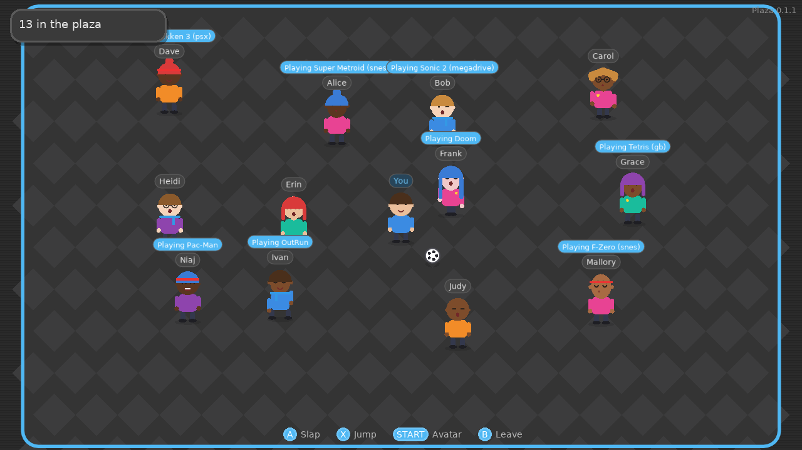

# BatWiiCera Plaza

A social channel for the [BatWiiCera](https://github.com/yiddifliddo/BatWiiCera)
Batocera theme: one shared online room where players meet as original cartoon
avatars, see what everyone is playing, run around, hop, slap and kick a ball.

**Author:** yiddifliddo (personal project)
**Current version:** 0.1.5
**Licence:** MIT

## Versions

| Version | Folder | Date | Status | Summary |
| --- | --- | --- | --- | --- |
| 0.1.5 | [`v0.1.5`](v0.1.5) | 2026-10-05 | Release candidate, awaiting on-device sign-off | Server fix: Railway sets PORT to the TCP proxy port; HTTP side now moves aside instead of crashing |
| 0.1.4 | [`v0.1.4`](v0.1.4) | 2026-10-05 | Superseded by 0.1.5 (server crash on Railway; client identical) | Public server built in, one-file Ports installer, automatic EmulationStation restart; author credit yiddifliddo |
| 0.1.3 | [`v0.1.3`](v0.1.3) | 2026-10-05 | Superseded by 0.1.4 | Terminal-free install from the client menu; presence URL sent by the server |
| 0.1.2 | [`v0.1.2`](v0.1.2) | 2026-10-05 | Superseded by 0.1.3 | Railway support: PORT, presence URL, host:port game address, Railway guide |
| 0.1.1 | [`v0.1.1`](v0.1.1) | 2026-10-05 | Superseded by 0.1.2 | Theme palette, follows the EmulationStation colour set (light/dark) |
| 0.1.0 | [`v0.1.0`](v0.1.0) | 2026-10-05 | Superseded by 0.1.1 | First release: server, LÖVE client, presence hook, installer, channel tile |




Each version lives in its own `vX.Y.Z/` folder with its own `README.md`
(set-up, controls, what changed) and built packages in `dist/`. Every change
is logged in [`CHANGE_CONTROL.md`](CHANGE_CONTROL.md).

## Quick start

The public server is built in, so there is nothing to host and nothing to
type. On each Batocera box, one of:

1. Extract the theme's `BatWiiCera-full-vX.Y.Z.zip` onto the share and
   reboot (theme and Plaza channel together), or
2. with the theme already installed, copy
   `v0.1.5/installer/Plaza.sh` into `share\roms\ports` and start **Plaza**
   from Ports once; it installs the channel and restarts EmulationStation, or
3. start `v0.1.5/dist/BatWiiCera-Plaza.love` from the LÖVE system and choose
   **Install Plaza channel**.

Then pick the **Plaza** channel, edit your avatar, enter the plaza.

Running your own server is optional: VPS (`v0.1.5/dist/BatWiiCera-Plaza-server.tar.gz`,
ports 7777 and 7778) or Railway (`v0.1.5/RAILWAY-SETUP.md`), then **Server
address** in the Plaza menu. Full details in [`v0.1.5/README.md`](v0.1.5/README.md).

## Repository layout

```
README.md            this file (version index)
CHANGE_CONTROL.md    change register, one record per change, never deleted
LICENSE              MIT
vX.Y.Z/              one folder per version: server/, client/, hook/, installer/, dist/, previews/
```

## Change control

Same process as the theme, modelled on ISO 27001:2022 Annex A control 8.32:
every change is a numbered record (PCR-nnnn) with author, risk, test evidence
and rollback; every version is a new folder; work happens on
`release/plaza-vX.Y.Z` branches merged to `main` on approval. The Plaza lives
in the `plaza/` folder of the BatWiiCera repository.

This is a fan-made companion to a fan-made theme. It is not affiliated with
or endorsed by any console manufacturer. Avatars, floor, ball and logo are
original designs; no third-party characters, artwork or audio are included.
