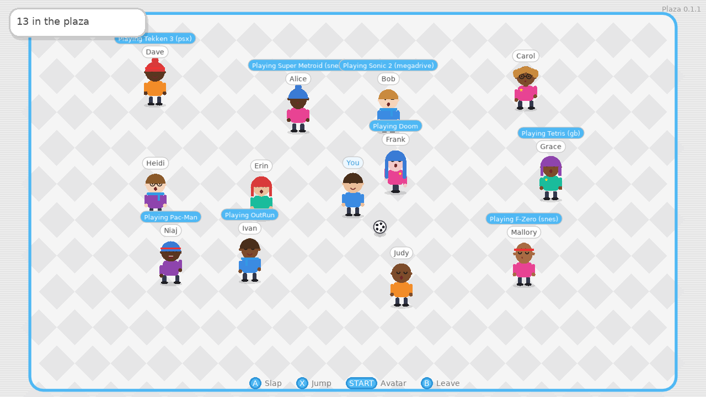

# BatWiiCera Plaza

A social channel for the [BatWiiCera](https://github.com/yiddifliddo/BatWiiCera)
Batocera theme: one shared online room where players meet as original cartoon
avatars, see what everyone is playing, run around, hop, slap and kick a ball.

**Author:** Dan Lee (personal project)
**Current version:** 0.1.2
**Licence:** MIT

## Versions

| Version | Folder | Date | Status | Summary |
| --- | --- | --- | --- | --- |
| 0.1.2 | [`v0.1.2`](v0.1.2) | 2026-10-05 | Release candidate, awaiting on-device sign-off | Railway support: PORT, presence URL, host:port game address, Railway guide |
| 0.1.1 | [`v0.1.1`](v0.1.1) | 2026-10-05 | Superseded by 0.1.2 | Theme palette, follows the EmulationStation colour set (light/dark) |
| 0.1.0 | [`v0.1.0`](v0.1.0) | 2026-10-05 | Superseded by 0.1.1 | First release: server, LÖVE client, presence hook, installer, channel tile |




Each version lives in its own `vX.Y.Z/` folder with its own `README.md`
(set-up, controls, what changed) and built packages in `dist/`. Every change
is logged in [`CHANGE_CONTROL.md`](CHANGE_CONTROL.md).

## Quick start

1. Host the server: on a VPS, unpack `v0.1.2/dist/BatWiiCera-Plaza-server.tar.gz`
   and run `node index.js` (or install the systemd unit) with ports 7777 and
   7778 open; or on Railway, follow `v0.1.2/RAILWAY-SETUP.md`.
2. On each Batocera box: `bash v0.1.2/installer/install-batocera.sh <your-host>`
   then restart EmulationStation.
3. Pick the new **Plaza** channel, edit your avatar, enter the plaza.

Full details in [`v0.1.2/README.md`](v0.1.2/README.md).

## Repository layout

```
README.md            this file (version index)
CHANGE_CONTROL.md    change register, one record per change, never deleted
LICENSE              MIT
vX.Y.Z/              one folder per version: server/, client/, hook/, installer/, dist/, previews/
```

## Change control

Same process as the theme, modelled on ISO 27001:2022 Annex A control 8.32:
every change is a numbered record (PCR-nnnn) with author, risk, test evidence
and rollback; every version is a new folder; work happens on
`release/plaza-vX.Y.Z` branches merged to `main` on approval. The Plaza lives
in the `plaza/` folder of the BatWiiCera repository.

This is a fan-made companion to a fan-made theme. It is not affiliated with
or endorsed by any console manufacturer. Avatars, floor, ball and logo are
original designs; no third-party characters, artwork or audio are included.
